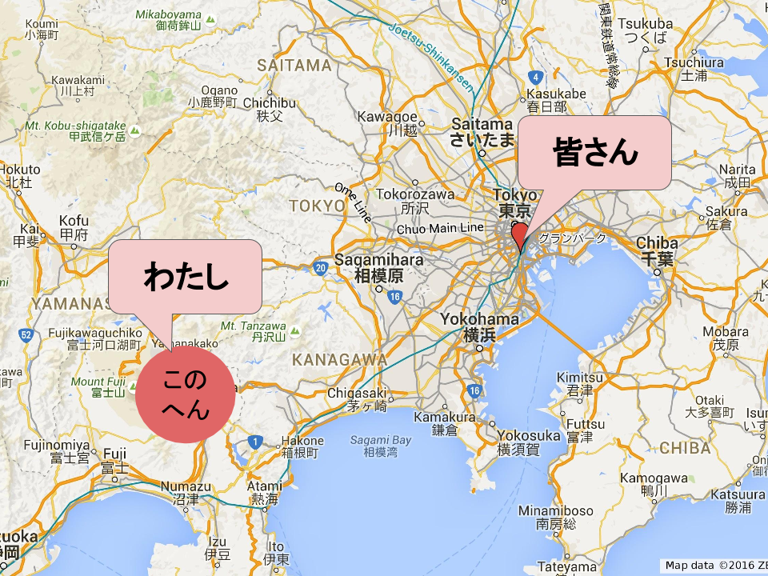

# echo めくるめくシェル芸の世界 ｜ less -S

Hisaharu Ishii

---

## Who am I

* Hisaharu Ishii (石井 久治)
* NTTソフトウェアイノベーションセンタ
* contacts
  * GitHub: https://github.com/hisaharu
  * Twitter: @hisaharu

---

## これからシェル芸の話をします

___

## が、その前に

___

## オマエ今どこよ？

___

## このへん



---

## (本カンファレンス初)
## リモート発表芸

___

## しくみ


---

## ではそろそろシェル芸の話を

___

# だが、その前にもう一つ

___

# このスライド
## 何で動いてるか分かります？

___

## Slideck by ゆーすけべー氏


___

## つかいかた

___

## 1.こういうMarkdownテキストを書く

```
## This is an H2 Title

Description...

The horizontal slide separator characters are '---'

ーーー

# This is second title

The vertical slide separator characters are '___'

＿＿＿

## This is a third title

ーーー

## This is a forth title
```

___

## 2.GitHubにpushする

___

## 3. スライドになる


___

## 4. Cooooooooool !!!

___

## ちなみに

Slideckはreveal.jsを使っているそうです
https://github.com/hakimel/reveal.js

---

## 閑話休題

---

## そろそろ
## (いい加減に)
## シェル芸の話をしようか

---

## シェル芸とは

___

## シェル芸の定義(本家)

https://blog.ueda.asia/?page_id=1434

```
シェル芸の定義バージョン1.1

マウスも使わず、ソースコードも残さず、GUIツールを立ち上げる間もなく、
あらゆる調査・計算・テキスト処理をCLI端末へのコマンド入力一撃終わらすこと。
あるいはそのときのコマンド入力のこと。
```

___

## どういうこと？

```
　　　　　　　　　　　　 　 ＿__　　　　━┓
　　　　　　　　　　　　 ／　―　＼ 　　┏┛
　　　　　　　　　　　／ノ　　(●) ＼　 ・
　　　　　　　　　　 ｜　(●) 　 ⌒） ＼
　　　　　　　　　　 ｜　　 （__ノ￣　　|
　　　　　　　　　　　＼　　　　　　　 /
　　　　　　　　　　　　 ＼　　　　 _ノ
　　　　　　　　　　　　　/´　　 　 ｀＼
　　　　　　　　　　　 　 |　　　　　　　|
　　　　　　　　　　　 　 |　　　　　　　|
```

---

## たとえば

### 問題:
### 2016年の日曜日を全て列挙してください。

　　　　　　　　　　出典: [第21回シェル芸勉強会 第3問](https://blog.ueda.asia/?p=7655)

___

## Excel職人:

* えーっと、まずDATE()関数で2016年1月1日と2016年12月31日のシリアル値を求めて...
* WEEKDAY()関数にシリアル値を渡せば曜日が分かるから...

___

## Python職人:

```
from datetime import date

d = date(2016,1,1)
while d < date(2017,1,1):
...
```

___

## シェル芸人

```
$ echo 2016{01..12}{01..31} | xargs -n1 | date -Rf- 2>/dev/null | grep Sun
```

---

## ナニコレ？

```
$ echo 2016{01..12}{01..31} | xargs -n1 | date -Rf- 2>/dev/null | grep Sun
```

___

## 分解してみる

___

## STEP1

```
$ echo 2016{01..12}{01..31}

20160101 20160102 20160103 20160104 20160105 20160106 20160107 20160108 2
0160109 20160110 20160111 20160112 20160113 20160114 20160115 20160116 20
160117 20160118 20160119 20160120 20160121 20160122 20160123 20160124 201
60125 20160126 20160127 20160128 20160129 20160130 20160131 20160201 2016
0202 20160203 20160204 20160205 20160206 20160207 20160208 20160209 20160
210 20160211 20160212 20160213 20160214 20160215 20160216 20160217 201602
18 20160219 20160220 20160221 20160222 20160223 20160224 20160225 2016022
6 20160227 20160228 20160229 20160230 20160231 20160301 20160302 20160303
...
```

___

## STEP2

```
$ echo 2016{01..12}{01..31} | xargs -n1

20160101
20160102
20160103
20160104
20160105
20160106
20160107
20160108
...
```

___

# STEP3

```
$ echo 2016{01..12}{01..31} | xargs -n1 | date -Rf- 2>/dev/null

Fri, 01 Jan 2016 00:00:00 +0900
Sat, 02 Jan 2016 00:00:00 +0900
Sun, 03 Jan 2016 00:00:00 +0900
Mon, 04 Jan 2016 00:00:00 +0900
Tue, 05 Jan 2016 00:00:00 +0900
Wed, 06 Jan 2016 00:00:00 +0900
Thu, 07 Jan 2016 00:00:00 +0900
Fri, 08 Jan 2016 00:00:00 +0900
...
```
___

# STEP4

```
$ echo 2016{01..12}{01..31} | xargs -n1 | date -Rf- 2>/dev/null | grep Sun

Sun, 03 Jan 2016 00:00:00 +0900
Sun, 10 Jan 2016 00:00:00 +0900
Sun, 17 Jan 2016 00:00:00 +0900
Sun, 24 Jan 2016 00:00:00 +0900
Sun, 31 Jan 2016 00:00:00 +0900
Sun, 07 Feb 2016 00:00:00 +0900
Sun, 14 Feb 2016 00:00:00 +0900
Sun, 21 Feb 2016 00:00:00 +0900
```

---

## つまり

```
echo 2016{01..12}{01..31} # 20160101 20160102 ... という数列を生成
                          # ただし、この時点では 20160231 など無効な日付を含む

xargs -n1                 # 数列を1行あたり1列になるように改行

date -Rf- 2>/dev/null     #標準入力から1行ずつ日付を読み込み(-fオプション)
                          #RFC822形式で出力(-Rオプション)
                          #無効な日付は標準エラーにメッセージが出力されるので
                          #/dev/nullデバイスにリダイレクトして黙殺

grep Sun                  #日曜日を表す行だけを抽出
```

---

## 【急募】シェル芸で解いて欲しい問題

「こんな問題、シェル芸で解ける？どう解く？」

という問題を募集します。

●  slackの #live もしくは

●  Twitter の #シェル芸

●  [hackmd](https://hackmd.paas.jp-e1.cloudn-service.com/JwQwbAHA7MBGsFoKwCYGMEBYDMZGxEwFYsVYBTbcgJhQhUwEYg==)

でツイートして下さい

※シェル芸で解ける保証はありませんが、

思いつきで投げかけてみて下さい

